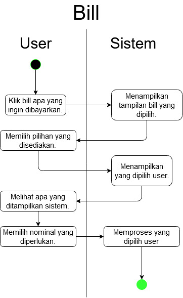

# Flick App (Flick – Payment, Shopping, Bill) --- developer email: info@cash-it.com

Aplikasi dapat diunduh dari link berikut: https://play.google.com/store/apps/details?id=com.flickapp.app .
Aplikasi flick berfokus kepada pembayaran dan pembelian barang melalui online, dengan kata lain ini adalah platform dompet digital yang baru akan berkembang. Aplikasi ini memiliki beberapa fitur utama yaitu flickshop, flickbill, dan flicksilvi di dalam aplikasi tersebut ketiga hal ini disebut dengan "Fitur keren dari kami".

## Give reasoning why it isn’t pleasant or cumbersome to use

Tampilan dari Flick App menarik dengan pemilihan warna yang tepat, juga peletakan tombol-tombol untuk fitur yang tertata dengan rapi. Hal ini menyebabkan tampilannya lebih efektif dan efisien. Adapun kekurangan dari Flick ini diantaranya:
- Peletakan ikon-ikon ada yang tidak sesuai.
- Ada 1 kecacatan pada judul fitur, ditombol tertulis "Tagihan Telepon" saat kita klik judul di halaman tersebut adalah "Internet".
- Untuk "Fitur keren dari kami" selalu dinavigasikan ke halaman yang sama dan tidak ada perbedaan sama sekali, hal ini dapat menyebabkan kebingungan untuk user yang kurang paham teknologi karena mereka bisa saja berpikiran aplikasinya rusak.
- Saat dinavigasikan ke halaman untuk "Fitur keren dari kami" (sebenarnya halaman itu adalah web mereka) ada beberapa tombol yang tidak dapat dipencet, ada 1 fitur untuk menjelaskan tentang aplikasinya yang hanya muncul selama 1 atau 2 detik, dan terdapat gap whitespace di footernya.
- Hal paling parah menurut saya adalah mengenai pengenalan aplikasi ini, karena memakan waktu yang agak lama untuk mempelajari fitur-fitur mereka, padahal seharusnya hal ini bisa diminimalisir dengan adanya halaman untuk pengenalan aplikasi pada homepage.

## Pointed out the flaw in interaction control

Terdapat beberapa kecacatan interaction control pada aplikasi ini, yakni:
- Saat mengklik "Fitur keren dari kami" selalu diarahkan ke halaman yang sama (halaman web mereka).
- Saat sudah dihalaman "Fitur keren dari kami" ada banyak tombol yang tidak bekerja sebagaimana mestinya.

## Identify Key business use cases

Sebenarnya banyak sekali business use case yang ada pada aplikasi ini, tetapi kami hanya memilih beberapa business use case utama. Landasan menentukan suatu use case dianggap use case utama, yakni:
- Top Up
- Shop
- Bill
- Pay

Hal-hal diatas adalah use case-use case utama dari Flick App atau mungkin ada beberapa use case lainnnya namun tidak terpantau oleh kelompok kami.

## Activity Diagrams

