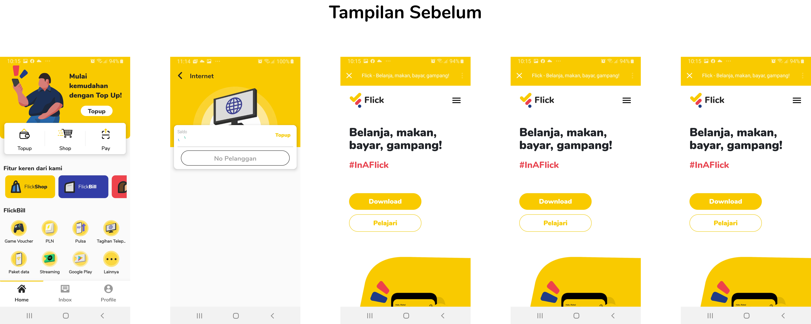
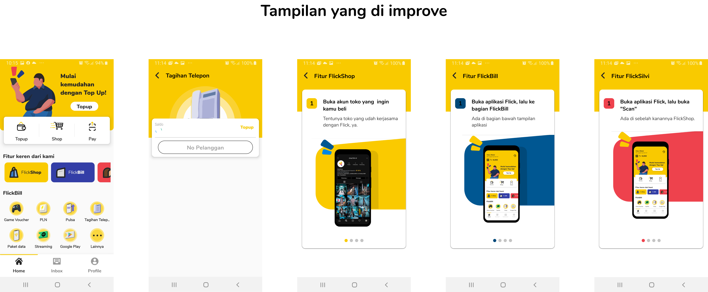
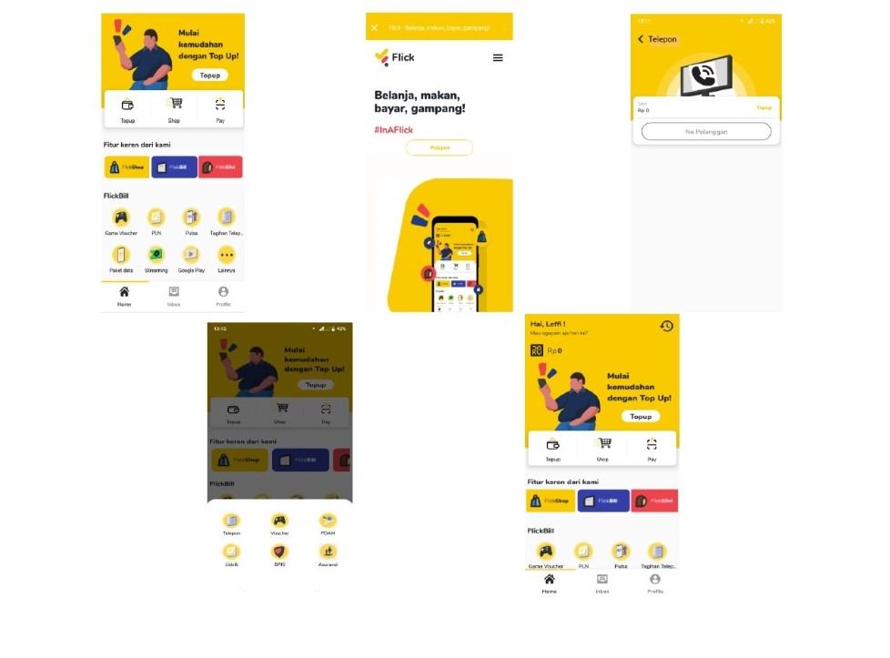

# Task 2
## Flick adalah 
>Flickapp adalah layanan E-Money untuk proses pembayaran , pembelian PPOB ( Pulsa / Data , Listrik prabayar & pascabayar, Internet Provider , Pembayaran Leasing kendaraan , Asuransi , BPJS ) , dan Rekening bersama untuk belanja Online secara aman yang di selanggarakan oleh PT. KREIGAN SENTRAL TEKNOLOGI.

## Day 1 Report (6 Oktober 2020)
>[IMK Day 1](https://youtu.be/v1pScGoJL4E)

## Day 2 Report(12 Oktober 2020)

## Design Asli

## Design Andri (Selected)

## Design Leffi

## Day 3 Report(13 Oktober 2020)

## Day 4 Report(14 Oktober 2020)
>[IMK - Day 4](https://youtu.be/1lK126OtSyA)

## Business process expansion to achieve better experience key features
>Pada halaman Fitur keren dari kami seharusnya Tampilan tidak masuk kehalaman website karena akan membingungkan user. kami menyarankan 
bahwa tampilan seharusnya tetap berada dalam aplikasi.

## For the accepted designs, there are explanation of which material design philosophy per components
1. Card
Bayangan pada setiap card.
Ini merupakan penerapan dari prinsip material yang terinsipirasi dari fisik dunia dan teksturnya, dimana card ini menghasilkan bayangan.
2. Typography
Penggunaan Font yang tebal.
Ini merupakan penerapan dari prinsip material yang kontennya dicetak tebal.

## Tools yang digunakan
>Figma
